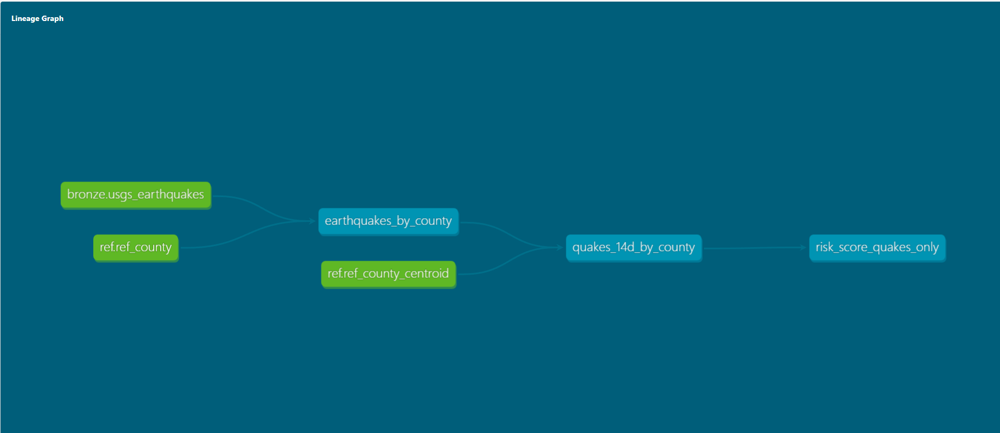

# Risk Signals Data Platform (MVP)

Local-first data platform that produces a **county-level risk score** with simple “why” explanations.

**Current MVP signal:** USGS earthquakes (last 14 days) rolled up to US counties.

Example output:
- Cook County, IL → `risk_score=…` (drivers: `X earthquakes detected in last 14 days`)

## Tech Stack
- Docker Compose
- Postgres + PostGIS
- SQL transformations (bronze → silver → gold)
- Python ingestion (idempotent ingestion with metadata)

## Data Model (Medallion)
- **Bronze:** raw USGS earthquake events (`usgs_earthquakes`) + ingest metadata (`ingested_at`, `updated_at`)
- **Silver:** earthquakes aggregated by county (spatial join)
- **Gold:** county `risk_score` + human-readable `drivers`

## Repo Layout
```text
docker/
    docker-compose.yml          #All requirements for docker creation
    initdb/
        001_init.sql            # Creates extensions / base DB setup (PostGIS, etc.)

scripts/
    db_smoke_test.py               # Verifies DB connection + PostGIS works
    load_ref_county.py             # Loads county reference data into DB
    ingest_usgs_earthquakes.py     # Fetches + loads USGS earthquakes into bronze
    sql/                           # SQL transformations (bronze → silver → gold)
        002_ref_county_centroids.sql
        010_bronze_usgs_earthquakes.sql
        011_bronze_usgs_add_ingest_cols.sql
        020_silver_earthquakes_by_county.sql
        030_gold_quakes_14d_by_county.sql
        040_gold_risk_score_quakes_only.sql

ingest/
  db.py                          # Shared DB helpers for Python ingest scripts

data/ref/                        # Reference datasets (county files, etc.)
airflow/                         # Reserved for orchestration later
dbt/                             # Reserved for modeling/testing later
```
## dbt lineage (DAG)



## Future Additions
- Second API ingestion (NOAA Storms)
- Third API ingestion (NWS Alerts)
- Airflow Orchestration


## Future Industry Use Cases 
- Insurance (P&C): inform underwriting/pricing, exposure management, and claims triage by tracking near–real-time hazard signals (storms/quakes/fires) by county/ZIP with explainable drivers.
- Banking / lending (mortgage, auto, small business): adjust credit/terms, portfolio exposure, collateral monitoring (e.g., flood/fire/storm risk near assets).
- Real estate / property management: where to buy/build, rent pricing, maintenance planning, disaster preparedness.
- Logistics / supply chain: route planning, hub placement, disruption monitoring (storms, earthquakes, wildfires).
- Utilities / energy: outage risk forecasting, vegetation/fire risk, crew staging, asset hardening prioritization.
- Government / emergency management: situational awareness dashboards, resource allocation, FEMA-style reporting support.
- Retail / location planning: store siting, inventory positioning, “will this region be disrupted next week?”
- Telecom: tower/site resilience, outage response planning, prioritizing backup power deployments.
- Agriculture: drought/precip anomalies, hail/severe storm impacts, risk to yields (often at county scale).
- Construction / infrastructure: project scheduling and risk buffers, contractor safety planning, material delivery risk.

## Quickstart
- You will need to download the 2018 US county zip file "cb_2018_county_500k.zip" and store it inside the folders data/ref
- You will need to setup your own .env file to store all the needed information to create a database in docker (DB, USER, and PASSWORD)

### Start services
```bash
# 1) Create Venv + install requirements
make venv
# 2) Run the end-to-end script for ingestion and transformation
make etl
# 3) View Results
make psql
# Then:
SELECT * FROM gold.risk_score_by_county ORDER BY quakes_14d DESC LIMIT 25;
```
